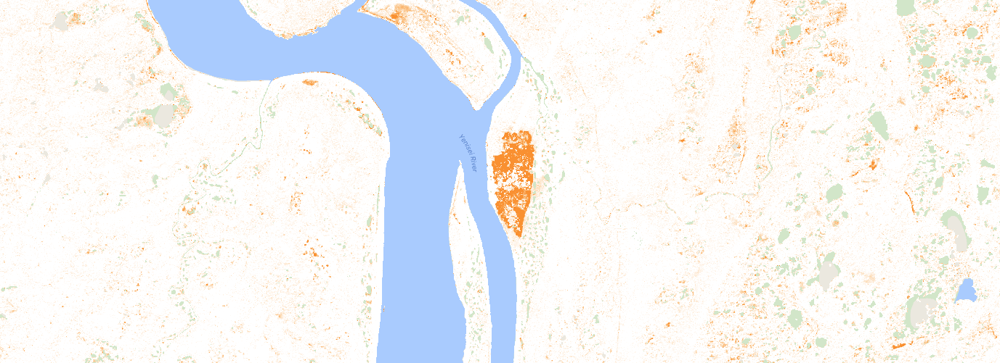

Starting on an fcc BA algorithm for use on GEE.

At present using to learn how this thing works.

Idea is to do as best masking as possible and then calculate
fcc between pre and post images

add some strict conditions to remove commission errors and use as a simple alg

